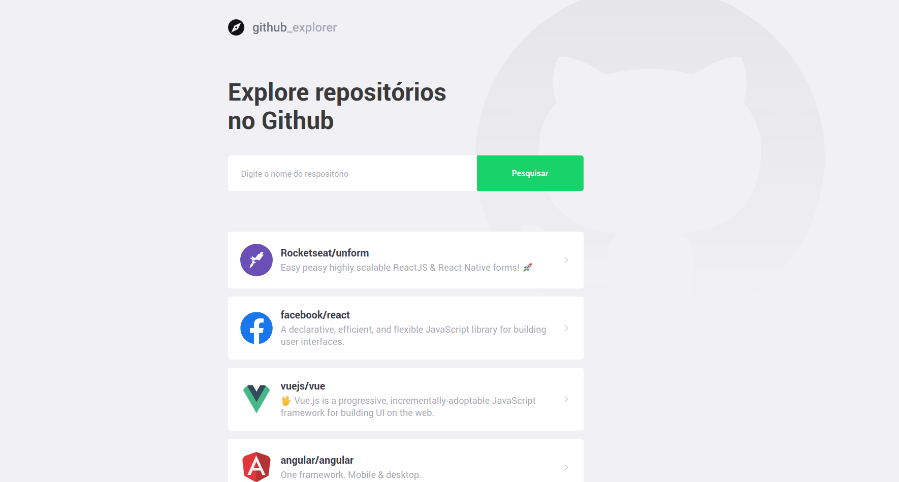

<p align="center">
  
</p>

<p align="center">
  The application aims to find any repository hosted on github, in addition to allowing you to view a list of open issues
</p>

<p align="center">
  

  

  

  

  

  

</p>

<p align="center">
  <a href="#hammer-technology">Technology</a>&nbsp;&nbsp;&nbsp;|&nbsp;&nbsp;&nbsp;
  <a href="#wrench-installation">Installation</a>&nbsp;&nbsp;&nbsp;|&nbsp;&nbsp;&nbsp;
</p>

### :computer: View

<p align="center">
  
</p>

## :hammer: Technology

- [ReactJS](https://reactjs.org/)
- [Styled-components](https://www.styled-components.com/)
- [ESLint](https://eslint.org/)
- [Prettier](https://prettier.io/)
- [EditorConfig](https://editorconfig.org/)
- [VS Code](https://code.visualstudio.com/)

## :wrench: Installation

```
  // 1 - Git Clone
  git clone https://github.com/joaocastellim/github-explorer

  // 2 - Installing the dependencies
  cd github-explorer && yarn install

  // 3 - Run the application
  yarn start

```
